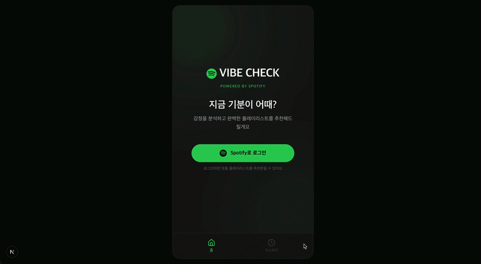

# 🎵 Vibe Check

> 지금 기분이 어때? — 감정과 날씨로 찾는 나만의 Spotify 플레이리스트

<br />



<br />

## 소개

현재 기분과 날씨를 선택하면 Spotify API를 통해 어울리는 플레이리스트를 추천해주는 웹앱입니다.
Spotify 계정으로 로그인하면 맞춤 추천을 받을 수 있습니다.

<br />

## 주요 기능

- **Spotify 로그인** — OAuth 2.0 Authorization Code Flow 기반 인증
- **기분 선택** — 우울함, 신남, 나른함, 화남, 설렘, 평온함
- **날씨 선택** — 맑음, 비, 흐림, 눈
- **플레이리스트 추천** — 기분 + 날씨 조합으로 Spotify 검색 (2회 병렬 검색 후 병합)
- **히스토리** — 로그인 시 이용 가능

<br />

## 기술 스택

| 분류 | 기술 |
|------|------|
| 프레임워크 | Next.js 16 (App Router) |
| 언어 | TypeScript 5 |
| 스타일링 | Tailwind CSS 4 |
| UI | lucide-react, recharts |
| 외부 API | Spotify Web API |
| 인증 | Spotify OAuth 2.0, HttpOnly Cookie |

<br />

## 실행 방법

### 1. 패키지 설치

```bash
npm install
```

### 2. 환경 변수 설정

`.env.local` 파일을 생성하고 아래 값을 입력합니다.

```env
SPOTIFY_CLIENT_ID=your_client_id
SPOTIFY_CLIENT_SECRET=your_client_secret
SPOTIFY_REDIRECT_URI=http://127.0.0.1:3000/api/auth/callback
NEXT_PUBLIC_APP_URL=http://127.0.0.1:3000
```

> Spotify Developer Dashboard에서 앱을 생성하고 Redirect URI를 등록해야 합니다.

### 3. 개발 서버 실행

```bash
npm run dev
```

브라우저에서 `http://127.0.0.1:3000` 으로 접속합니다.

> `localhost:3000` 이 아닌 `127.0.0.1:3000` 으로 접속해야 Spotify 인증이 정상 동작합니다.
